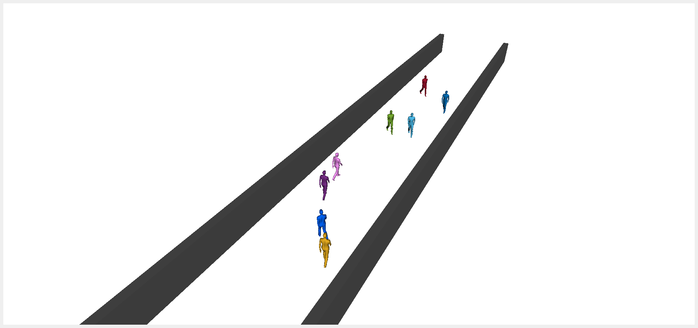

# Overview
This package is an interactive pedestrian simulation package using ROS2 and C++ based on `libpedsim` by Christian Gloor. 

This package does not use generalized interfaces and output messages are handcrafted for a particular planner. It is mainly intended for internal usage.

## Features

- Simulating pedestrians using the social forces model (interacting with other pedestrians)

- Adding a robot that the pedestrians interact with

- Adding static obstacles that affect the pedestrian behavior

- Retrieving pedestrian predictions that match their intended behavior

- Simulating Gaussian uncertainty in pedestrian behavior


---
## Example
An example corridor simulation can be started using

```
ros2 launch pedestrian_simulator simulation.launch.py
```

You should see a scene with 8 pedestrians:



## Scenario Encoding

Scenarios are encoded in an xml format where static obstacles are specified as lines. 

Pedestrians are spawned randomly in this example within some x and y, with random realistic velocities and with the goal set randomly on the other side of the corridor.

Pedestrians can also be spawned exactly, see `scenarios/static/0_middle.xml` for example

```xml
<?xml version="1.0" encoding="UTF-8"?>
<!-- Pedestrian type -->
<tag type="social"/> 

<!--Static Obstacles-->
<obstacle x1="-6.5" y1="-3.5" x2="39.5" y2="-3.5"/>
<obstacle x1="-6.5" y1="3.5" x2="39.5" y2="3.5"/>

<!-- Dynamic Obstacle Spawns -->
<random>
    <range_x min="4" max="12"/>
    <range_y min="-3" max="3"/>
    <range_v min="1.14" max="1.66"/>
    <goal_offset x="30" y="0"/>   <!-- Inflates where the goal can be -->
</random>
<random>
    <range_x min="20" max="35"/>
    <range_y min="-3" max="3"/>
    <range_v min="1.14" max="1.66"/>
    <goal_offset x="-30" y="0"/>   <!-- Inflates where the goal can be -->
</random>

<!-- Pedestrians -->
<pedestrian>
    <tag type="random"/>
</pedestrian>
<pedestrian>
    <tag type="random"/>
</pedestrian>
<pedestrian>
    <tag type="random"/>
</pedestrian>
<pedestrian>
    <tag type="random"/>
</pedestrian>
<pedestrian>
    <tag type="random"/>
</pedestrian>
<pedestrian>
    <tag type="random"/>
</pedestrian>
<pedestrian>
    <tag type="random"/>
</pedestrian>
<pedestrian>
    <tag type="random"/>
</pedestrian>
```